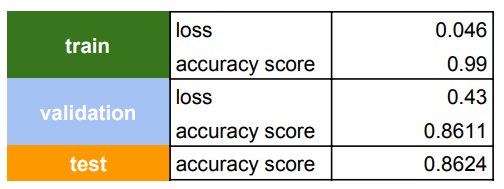

# Udacity's Nanodegree in Data Science: Capstone Project

The main problems addressed by this project is to classify images of dogs according to their breed using CNN (Convolutional Neural Networks) and implementing a web application to provide online dog breeds detection.
Detecting dog breed is extremely challenging, even for humans: 

 

Brittany vs Welsh Springer Spaniel

Please find [here](https://besson.medium.com/using-deep-learning-to-identify-your-dog-breed-d3c8737b78b1) my Medium blog post with a project overview. The Capstone project is divided into the following 2 main sub-projects.

# Training a model for dog breed detection 

In this project, I've implemented a [Convolutional Neural Network (CNN)](https://en.wikipedia.org/wiki/Convolutional_neural_network) using [transfer learning](https://en.wikipedia.org/wiki/Transfer_learning) to detect dog breeds from a photo.
The pre-computed network used is [Xception](https://arxiv.org/abs/1610.02357). Udacity instructors provided guidelines, notebooks, code templates and base models for this exercise. 
Please follow [dog-project/README.md](https://github.com/besson/ds-capstone-project/blob/master/dog-project/README.md) for more information.


## Model
Preloaded networks trained on Imagenet dataset were provided by Udacity instructors. For each model, I’ve applied the methodology above compiling the model using the same parameters I used in my CNN from scratch. After the evaluation I had the following results:

| Pre-trained Network | Accuracy score |
| :- | :-: |
| VGG19 | 71.90 % |
| Resnet50 | 81.94 % |
| InceptionV3 | 82.30 % |
|Xception | 86.36 % |
|||


Given, the good results, the winner was and it had the following architecture:


As can be observed, I’ve used the pre-trained layer and only added a dropout layer, to avoid overfitting, and dense layer with exactly 133 units which is the number of classes to be predicted.

## Model Evaluation and Validation
Here, we can find the training, validation and test results:



## More information about this project
All code to train, valid and test different networks, saving the model as well as the analysis to evaluate the best network can be found at [dog-project/dog_app.ipynb](https://github.com/besson/ds-capstone-project/blob/master/dog-project/dog_app.ipynb).
This notebook template was provided by Udacity and extended by me during the project.

Please also check [here](https://besson.medium.com/using-deep-learning-to-identify-your-dog-breed-d3c8737b78b1) my Medium blog post about this project.


# Doggo: A web application to run online detections

Doggo is a Flask web app application to run Dog breed detection models. Based on a photo upload by a user, Doggo runs the following steps:

1. Encode uploaded photo for running dog detector, human face detector and dog breed detector models
2. If the photo is classified as a dog or a human face, it predicts dog breeds
3. For the top n predictions, Doggo calls [Wikipedia](http://wikipedia.com) and [dog.ceo](https://dog.ceo) to find more information about the predicted breeds
4. Return results to user


## Instructions <a name="instructions"></a>
1. Go to `doggo` folder
2. Install de dependencies defined in `requirements.txt`
3. The app has already trained models for detecting dog, human faces and dog breeds. In case of update, you need to save the new models at `models` folder
4. Running the app locally: 
    ```
        python doggo.py
    ```
5. Go to http://0.0.0.0:3001

## File Descriptions <a name="files"></a>

* **core/**: All backend code for parsing images, instantiating models, running and formatting predictions, ...
* **core/models/**: Required mdels such as CNN Dog Breed detector and opencv human face detector model.
* **templates/**: Flask html files
* **doggo.py**: Flask app routes
* **requirements.txt**: Project dependencies

## Web app <a name="app"></a>
For an uploaded photo, the app runs the model and displays the main dog breed and probability of top n dog breeds:


When the models cannot the detect a dog or a human face in the uploaded photo, Doggo returns the following message:


## Licensing, Authors, and Acknowledgements
Must give credit to Udacity for providing the dataset and guidelines to run the models. More information about that can be found at: [dog-project/](https://github.com/besson/ds-capstone-project/tree/master/dog-project)

Doggo is under MIT License.


