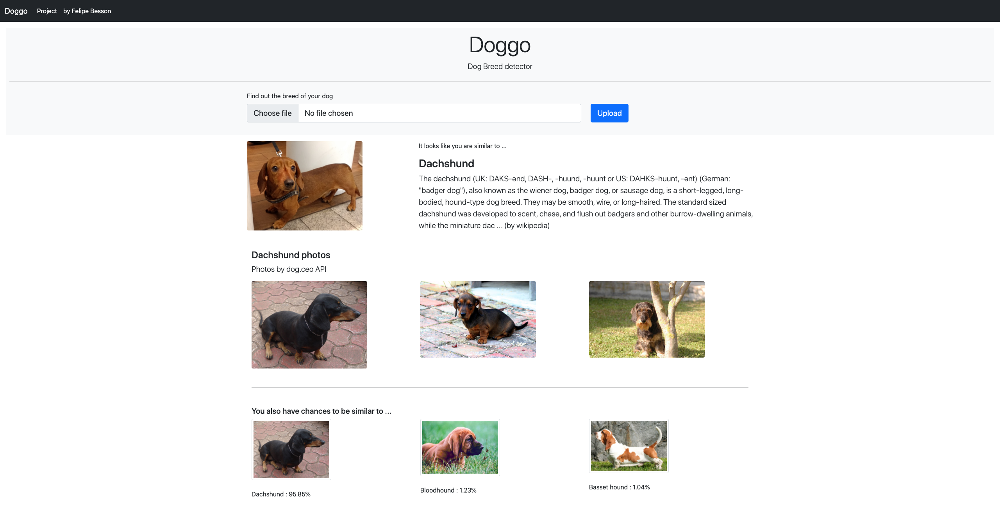
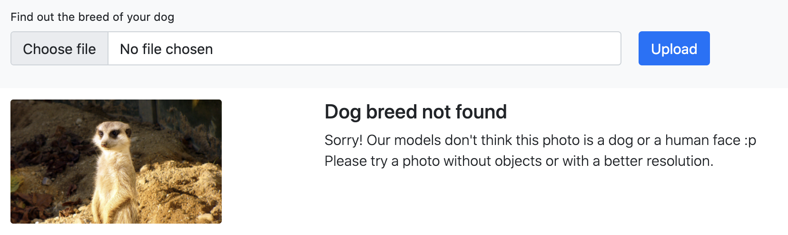

## Doggo
Doggo is a Flask web app application to run Dog breed detection models. Based on a photo upload by a user, Doggo runs the following steps:

1. Encode uploaded photo for running dog detector, human face detector and dog breed detector models
2. If the photo is classified as a dog or a human face, it predicts dog breeds
3. For the top n predictions, Doggo calls [Wikipedia](http://wikipedia.com) and [dog.ceo](https://dog.ceo) to find more information about the predicted breeds
4. Return results to user

### Table of Contents

1. [Instructions](#instructions)
3. [File Descriptions](#files)
4. [Web app](#app)
5. [Licensing, Authors, and Acknowledgements](#licensing)

## Instructions <a name="instructions"></a>
1. Build docker image:
   ```
   docker build -t doggo .
   ``` 
2. The app has already trained models for detecting dog, human faces and dog breeds. In case of update, you need to save the new models at `models` folder
3. Running the app locally: 
    ```
    docker run -p 5000:80 doggo
    ```
4. Go to http://0.0.0.0:5000

## File Descriptions <a name="files"></a>

* **core/**: All backend code for parsing images, instantiating models, running and formatting predictions, ...
* **core/models/**: Required mdels such as CNN Dog Breed detector and opencv human face detector model.
* **templates/**: Flask html files
* **doggo.py**: Flask app routes
* **requirements.txt**: Project dependencies

## Web app <a name="app"></a>
For an uploaded photo, the app runs the model and displays the main dog breed and probability of top n dog breeds:



When the models cannot the detect a dog or a human face in the uploaded photo, Doggo returns the following message:



## Licensing, Authors, and Acknowledgements
Must give credit to Udacity for providing the dataset and guidelines to run the models. More information about that can be found at: [dog-project/](https://github.com/besson/ds-capstone-project/tree/master/dog-project)

Doggo is under MIT License.
